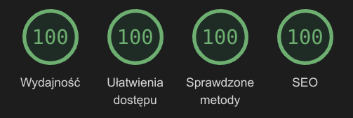
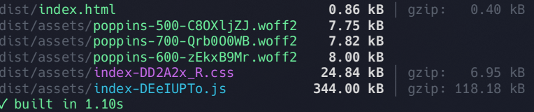

# CanvasEditor

This is a creator of posters. Available features:

✨ Add background from disk
✨ Add image from disk and customize its size and position
✨ Add text and customize the color, position and available area of the text
✨ Download PNG image (1080px by 1350px)
✨ Not satisfied of your poster? Reset and start again!

$${\color{magenta}Live \space Demo:}$$ [GitHub Pages](https://moose96.github.io/canvas-editor/)

### Video presentation

*TODO*

### Web vitals

🚀 Ultra fast (0.4s Speed Index, LCP and FCP)
🚀 344kB bundle size





## Setup

### Prerequisites

- Node.js v22.13.1
- pnpm v9.x

Install fresh packages:

```bash
pnpm i --frozen-lockfile
```

## Running

### Dev server

```bash
pnpm dev
```

### Building for production and running production server

```bash
pnpm build
pnpm preview
```

Application will be built in `dist` directory.

### Testing

```bash
pnpm test
```

## Deploy

This repository is configured with Continuous Deployment strategy, that means that every time you push changes to `main` branch,
GitHub Pages will be deployed.

## Tech stack

- [React.js 18](https://react.dev/)
- [Tailwind 4.x](https://tailwindcss.com/)
- [Canvg](https://canvg.js.org/) - for drawing SVG files on canvas
- [TypeScript](https://www.typescriptlang.org/docs/)

### Dev stack

- [Vite](https://vite.dev/config/)
- [Vitest](https://vitest.dev/config/)
- [Eslint](https://eslint.org/docs/latest/)
- [Prettier](https://prettier.io/docs/)
- [SVGR](https://react-svgr.com/docs/options/) - loading SVG files as React components
